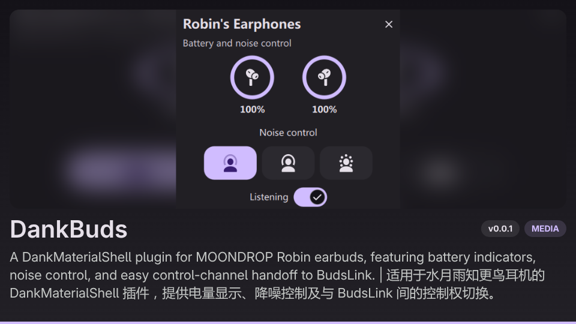

# DankBuds

A [DankMaterialShell](https://github.com/AvengeMedia/DankMaterialShell) plugin for the
MOONDROP Robin earbuds.

DankBuds adds a compact earbud widget to DankBar. It displays the battery level of each earbud,
provides three-state noise control, and communicates with the earbuds directly through their
Bluetooth SPP control channel.



## Features

- Circular left and right earbud battery indicators.
- Noise cancellation, off, and transparency controls.
- A DankBar widget that appears when the earbuds are connected.
- A persistent listening switch for releasing the control channel to another application.
- A plugin setting for changing control-channel ownership while the widget is hidden.
- Automatic reconnect and periodic state refresh.
- Theme-aware icons and controls.

## Requirements

- DankMaterialShell 1.5.0 or newer.
- BlueZ.
- Python 3.
- Python D-Bus and GObject bindings.
- MOONDROP Robin earbuds paired through the system Bluetooth settings.

On Arch Linux and derivatives, the required system packages can be installed with:

```bash
sudo pacman -S --needed bluez bluez-utils python python-dbus python-gobject
```

## Installation

Clone the repository into the DankMaterialShell plugin directory:

```bash
git clone https://github.com/Rea1-ms/DankBuds.git \
  ~/.config/DankMaterialShell/plugins/DankBuds
```

Enable **Dank Buds** in the DMS plugin settings, add `dankBuds` to the desired DankBar widget
section, then restart the shell:

```bash
dms restart
```

Connect the earbuds through the normal system Bluetooth interface. The widget appears in DankBar
after a matching Robin device is connected.

## Usage

Click the earbud icon in DankBar to open the controls. The two rings show the current left and
right battery levels. Select one of the three icons below them to change the noise-control mode.

The **Listening** switch controls ownership of the Robin SPP channel:

- Keep it enabled when using DankBuds.
- Disable it before starting [BudsLink](https://github.com/maniacx/BudsLink).
- Enable it again after BudsLink has closed.

The same switch is available from the DMS plugin settings when the earbud widget is hidden.

Disabling listening closes the active RFCOMM channel, unregisters the BlueZ profile, and leaves the
DankBar icon visible so the plugin can be enabled again. The Bluetooth audio connection is not
disabled.

Only one application can reliably own the Robin control channel at a time. DankBuds and BudsLink
therefore cannot provide private battery and noise control simultaneously.

## Supported device

The current implementation supports only MOONDROP Robin devices identified by one of these names:

- `Robin's Earphones`
- A name containing both `MOONDROP` and `Robin`
- A name containing both `水月雨` and `知更鸟`

Other MOONDROP models are not treated as Robin devices merely because they expose the standard SPP
UUID.

## Known limitations

- Charging-case battery level and charging state are not available in the confirmed Robin protocol.
- The plugin and another Robin controller must take turns owning the control channel.
- Noise controls remain unavailable until the protocol handshake succeeds.

## How it works

The QML plugin provides the DankBar widget and popout. A small Python backend registers a BlueZ SPP
client profile, opens the Robin RFCOMM channel, performs the protocol handshake, and exchanges
battery and noise-control frames. The frontend receives state through a session D-Bus service.

The backend validates the device name and protocol handshake before exposing private controls.

## Credits and licensing

- The Robin protocol implementation follows the independently implemented documentation in
  [HyperEars](https://github.com/silverpoetry/HyperEars/blob/main/docs/moondrop-robin-protocol.md).
- The underlying protocol facts were documented by Star-ZER0 in
  [Pods Protocol Reverse Engineering](https://github.com/Star-ZER0/Pods-Protocol-Reverse-Engineering/blob/2d97d85b2cde9ee1446e9e7f67c222ac9b9f2bb9/handmade/MOONDROP-Protocol.txt),
  licensed under CC BY-SA 4.0.
- Earbud and noise-control icon shapes are adapted from
  [BudsLink](https://github.com/maniacx/BudsLink), licensed under GPL-3.0-or-later.

This project is licensed under GPL-3.0-only. See [LICENSE](LICENSE). Keep the attribution above when publishing modified versions.

MOONDROP and Robin are used only to describe device compatibility. This project is independent and
is not affiliated with or endorsed by MOONDROP.
